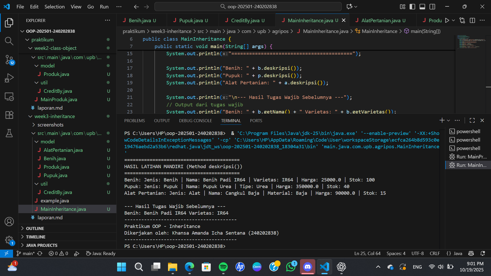

# Laporan Praktikum Minggu 3
Topik: Penerapan Konsep Inheritance (Pewarisan) dalam Sistem POS Pertanian

## Identitas
- Nama  : Khansa Amanda Icha Sentana
- NIM   : 240202838
- Kelas : 3IKRA

---

## Tujuan
Mahasiswa memahami konsep pewarisan (inheritance) dalam pemrograman berorientasi objek (OOP) serta dapat mengimplementasikan hubungan antar class (superclass dan subclass) melalui contoh program yang menampilkan data produk pertanian seperti benih, pupuk, dan alat pertanian.
---

## Dasar Teori
1. Inheritance (pewarisan) adalah konsep OOP yang memungkinkan sebuah class (subclass) mewarisi atribut dan metode dari class lain (superclass).

2. Superclass adalah class induk yang menyediakan atribut dan metode dasar yang dapat digunakan kembali oleh subclass.

3. Subclass adalah class turunan yang dapat menambahkan atau mengubah perilaku dari superclass.

4. Inheritance meningkatkan reusabilitas kode dan mempermudah pengelolaan struktur program yang kompleks.

5. Kata kunci extends digunakan di Java untuk menghubungkan subclass dengan superclass.
---

## Langkah Praktikum
1. Langkah-langkah yang dilakukan:

a. Membuka proyek OOP-202501-240202838 di Visual Studio Code.

b. Membuat folder baru week3-inheritance di dalam folder praktikum.

c. Membuat beberapa file Java untuk menerapkan konsep inheritance (pewarisan class).

d. Menulis kode pada masing-masing class (Produk, Benih, Pupuk, AlatPertanian, CreditBy, dan MainInheritance).

e. Menjalankan program melalui terminal VS Code menggunakan perintah Run: MainInheritance.

f. Mengamati hasil output yang menampilkan informasi dari method deskripsi() dan hasil tugas sebelumnya.

2. File/kode yang dibuat:

a. Produk.java

b. Benih.java

c. Pupuk.java

d. AlatPertanian.java

e. CreditBy.java

f. MainInheritance.java

3. Commit message yang digunakan:

a. Add week3 inheritance files and main program

b. Implementasi method deskripsi() untuk class turunan

c. Run program MainInheritance dan verifikasi output
---

## Kode Program
1. package main.java.com.upb.agripos.model; 

public class AlatPertanian extends Produk {
    private String material;

    public AlatPertanian(String kode, String nama, double harga, int stok, String material) {
        super(kode, nama, harga, stok);
        this.material = material;
    }

    // tambahan
    public String deskripsi() {
        return "Jenis: Alat | Nama: " + getNama() + " | Material: " + material +
               " | Harga: " + getHarga() + " | Stok: " + getStok();
    }

    public String getMaterial() { return material; }
    public void setMaterial(String material) { this.material = material; }
}
2. package main.java.com.upb.agripos.model; 

public class Benih extends Produk {
    private String varietas;

    public Benih(String kode, String nama, double harga, int stok, String varietas) {
        super(kode, nama, harga, stok);
        this.varietas = varietas;
    }

    // tambahan 
    public String deskripsi() {
        return "Jenis: Benih | Nama: " + getNama() + " | Varietas: " + varietas +
               " | Harga: " + getHarga() + " | Stok: " + getStok();
    }

    public String getVarietas() { return varietas; }
    public void setVarietas(String varietas) { this.varietas = varietas; }
}
3. package main.java.com.upb.agripos.model;

public class Produk {
    private String kode;
    private String nama;
    private double harga;
    private int stok;

    public Produk(String kode, String nama, double harga, int stok) {
        this.kode = kode;
        this.nama = nama;
        this.harga = harga;
        this.stok = stok;
    }

    public String getKode() { return kode; }
    public String getNama() { return nama; }
    public double getHarga() { return harga; }
    public int getStok() { return stok; }
}
4. package main.java.com.upb.agripos.model; 

public class Pupuk extends Produk {
    private String jenis;

    public Pupuk(String kode, String nama, double harga, int stok, String jenis) {
        super(kode, nama, harga, stok);
        this.jenis = jenis;
    }

    // tambahan
    public String deskripsi() {
        return "Jenis: Pupuk | Nama: " + getNama() + " | Tipe: " + jenis +
               " | Harga: " + getHarga() + " | Stok: " + getStok();
    }

    public String getJenis() { return jenis; }
    public void setJenis(String jenis) { this.jenis = jenis; }
}
5. package main.java.com.upb.agripos.util; // Package diperbaiki

public class CreditBy {
    public static void print(String nim, String nama) {
        System.out.println("----------------------------------------");
        System.out.println("Praktikum OOP - Inheritance");
        System.out.println("Dikerjakan oleh: " + nama + " (" + nim + ")");
        System.out.println("----------------------------------------");
    }
}
6. package main.java.com.upb.agripos; 

import main.java.com.upb.agripos.model.*; 
import main.java.com.upb.agripos.util.CreditBy;

public class MainInheritance {
    public static void main(String[] args) {
        // Subclass
        Benih b = new Benih("BNH-001", "Benih Padi IR64", 25000, 100, "IR64");
        Pupuk p = new Pupuk("PPK-101", "Pupuk Urea", 350000, 40, "Urea");
        AlatPertanian a = new AlatPertanian("ALT-501", "Cangkul Baja", 90000, 15, "Baja");
    
        System.out.println("=========================================");
        System.out.println("HASIL LATIHAN MANDIRI (Method deskripsi())");
        System.out.println("=========================================");
        
        System.out.println("Benih: " + b.deskripsi());
        System.out.println("Pupuk: " + p.deskripsi());
        System.out.println("Alat Pertanian: " + a.deskripsi());
        
        System.out.println("\n--- Hasil Tugas Wajib Sebelumnya ---");
        // Output dari tugas wajib 
        System.out.println("Benih: " + b.getNama() + " Varietas: " + b.getVarietas());
        
        CreditBy.print("240202838", "Khansa Amanda Icha Sentana"); 
    }
}
---

## Hasil Eksekusi

---

## Analisis
1. Penjelasan bagaimana kode berjalan

Program MainInheritance.java menjalankan konsep pewarisan (inheritance) dalam OOP.
Kelas Benih, Pupuk, dan AlatPertanian merupakan turunan dari kelas induk Produk.
Masing-masing memiliki atribut tambahan dan method deskripsi() yang menampilkan informasi lengkap produk.
Pada main(), objek dari ketiga kelas dibuat, lalu dipanggil method deskripsi() untuk menampilkan hasil latihan mandiri, kemudian dilanjutkan menampilkan hasil tugas wajib sebelumnya yang memanggil getter seperti getNama() dan getVarietas().
Output di terminal menunjukkan data tiap produk (nama, jenis, harga, stok, dll) berhasil ditampilkan sesuai pewarisan dan override method.

2. Perbedaan pendekatan minggu ini dibanding minggu sebelumnya

Minggu ini menggunakan konsep inheritance, sedangkan minggu sebelumnya masih berfokus pada class dan object dasar tanpa hubungan antar kelas.
Artinya, kini program lebih efisien karena atribut dan method umum ditempatkan di kelas induk (Produk), sementara kelas turunan (Benih, Pupuk, AlatPertanian) hanya menambahkan atribut atau perilaku khusus.
Pendekatan ini memperkenalkan reusability dan polymorphism dalam kode.

3. Kendala yang dihadapi dan cara mengatasinya

Beberapa kendala yang umum muncul yaitu:

Error package atau import, karena struktur folder (com.upb.agripos.model) harus sesuai dengan deklarasi package di tiap file.
a. Diatasi dengan memastikan folder dan deklarasi package konsisten.

Kesalahan pemanggilan method override (misal deskripsi() tidak terbaca).
b. Diatasi dengan menambahkan @Override pada method di kelas turunan.

Kompilasi gagal karena file belum disimpan atau belum di-build ulang.
c. Diselesaikan dengan menyimpan semua file dan menjalankan ulang Run MainInheritance.
---

## Kesimpulan
Dengan menerapkan konsep inheritance, program menjadi lebih efisien dan mudah dikembangkan karena kode yang sama dapat digunakan kembali oleh kelas turunan serta memudahkan pengelolaan data dan perluasan fitur.

---

## Quiz
1. Apa keuntungan menggunakan inheritance dibanding membuat class terpisah tanpa hubungan? 
Dengan inheritance, kode menjadi lebih efisien dan mudah dipelihara karena atribut dan method yang sama cukup ditulis sekali di superclass. Subclass dapat mewarisi dan menyesuaikan perilaku tanpa perlu menduplikasi kode, sehingga program lebih terstruktur dan fleksibel untuk dikembangkan.

2. Bagaimana cara subclass memanggil konstruktor superclass?
Subclass dapat memanggil konstruktor dari superclass dengan menggunakan keyword super() yang ditempatkan di baris pertama dalam konstruktor subclass. Pemanggilan ini berfungsi untuk mewarisi dan menginisialisasi atribut yang sudah didefinisikan di kelas induk, sehingga tidak perlu menulis ulang kode inisialisasi. Contohnya pada kelas Benih yang merupakan turunan dari Produk, konstruktor Benih dapat memanggil konstruktor Produk menggunakan super(nama, harga, stok); agar atribut tersebut langsung diinisialisasi oleh superclass.

3. Berikan contoh kasus di POS pertanian selain Benih, Pupuk, dan Alat Pertanian yang bisa dijadikan subclass.
Contoh kasus lain di POS pertanian yang bisa dijadikan subclass adalah ObatTanaman. Kelas ini dapat digunakan untuk menyimpan data produk seperti pestisida atau fungisida yang digunakan petani untuk melindungi tanaman dari hama dan penyakit. Subclass ini bisa memiliki atribut tambahan seperti jenisHama, dosisPemakaian, dan tanggalKadaluarsa, selain atribut umum seperti nama, harga, dan stok yang diwarisi dari kelas induk Produk. Dengan demikian, sistem POS dapat lebih mudah mengelola berbagai jenis produk pertanian secara terstruktur dan spesifik sesuai kategori.

[def]: <Screenshot 2025-10-19 210201.png>